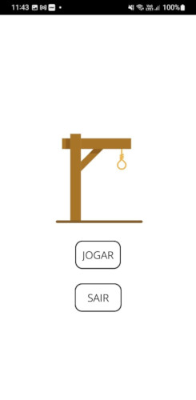
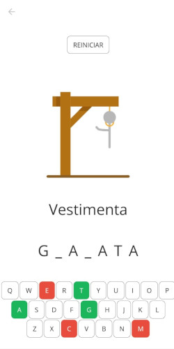
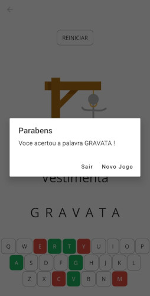

Aplicativo que visa replicar o famoso jogo da forca, onde o jogador deve acertar a palavra sorteada, tendo como dica o número de letras da palavra e o tema da mesma.
O teclado e o personagem da forca são atualizados conforme o jogador erra ou acerta as letras.

